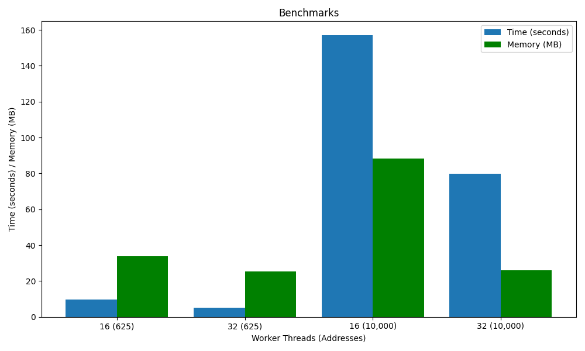

# Pinging the internet
Inspired by [Tom7's Harder Drive](http://tom7.org/harder/) project, this repo provides the utilities to ping every IP address in the IPv4 address space.

## Create IP List
There are 2^32 possible IP addresses, or around 4.2 billion addresses. The output list will be stored in `ip_list.txt`.

### Exponential Range
To skip addresses and create a list within a range of `range^4`, use the `generate_ip_list.py` script:

```shell
sudo python3 generate_ip_list.py <range>
```

Provide a 0-256 range value.
**NOTE: This script requires elevated privilages to write to the output file**

Example Usage:
```shell
sudo python3 generate_ip_list.py 1
```

Output:
```
0.0.0.0
```

### Ordered Range
To create an IP list between a defined IP range, use the `generate_ip_range.py` script:

```shell
sudo python3 generate_ip_range.py <start_range> <end_range>
```

Provide a start and end range between `0.0.0.0` to `255.255.255.255`.

Example Usage:
```shell
sudo python3 generate_ip_range.py 0.0.0.0 0.0.0.5
```

Output:
```
0.0.0.0
0.0.0.1
0.0.0.2
0.0.0.3
0.0.0.4
0.0.0.5
```

## Pinging IPs
There are three scripts for pinging the IPs from the `ip_list.txt`. See below:
**NOTE: Sending ICMP echo requires elevated permissions, use sudo for all scripts below**

All scripts will output to `icmp_responses.txt`. See the sample output below:

`1` is alive, `0` is dead.

```
0.0.0.0,0
0.0.0.1,0
0.0.1.0,0
0.0.1.1,0
0.1.0.0,0
0.1.0.1,0
0.1.1.0,0
0.1.1.1,0
1.0.0.0,0
1.0.0.1,1
1.0.1.0,0
1.0.1.1,0
1.1.0.0,0
1.1.0.1,0
1.1.1.0,1
1.1.1.1,1
```

### No delay 
Use the no delay script for smaller amounts (>625) of IPs. To send ICMP echos without a delay, run the `ping_no_delay.py` script:

```shell
sudo python3 ping_no_delay.py
```

### Chunk/Delay
Use the chunk delay script for large amounts (>2000) of IPs. ICMP echo utilizes a lot of bandwidth, therefore we need to limit the requests sent out into chunks. run the `ping_delay.py` script.

You can modify the `chunk size` and `delay between chunks` with command line arguments to increase the amount of data sent. The larger the chunk size, the larger the delay should be.

```shell
sudo python3 ping_delay.py --chunk <chunk_size> --delay <delay_between_chunk>
```

Example:

```shell
sudo python3 ping_delay.py --chunk 4 --delay 2
```

This will ping 4 IP Addresses every 2 seconds.

*Default: 300 chunk, 5 delay*

### Worker threads
Use the worker thread script for extremely large amounts (>10000) of IPs. Use the [benchmarks](#benchmarks) below to get an idea of how many threads to use for your batch size. run the `ping_worker.py` script.

You can modify the `thread` number with command line arguments to use more or less threads.

```shell
sudo python3 ping_worker.py --thread <thread>
``` 

Example:

```shell
sudo python3 ping_worker.py --thread 128
```

This will use 128 worker threads.

*Default: 32 threads*

## Image Output
To view the results as a bitmap image with black pixels representing dead hosts, and white pixels representing alive hosts, we can use the `create_map.py` script:

**NOTE: If you run this with elevated privilages, you will get permission issues viewing the image.**

```shell
python3 bitmaps/create_map.py
```

View the sample outputs below:

### 10,000 Addresses


### 50,000 Addresses


### 100,000 Addresses


### NKU Mapping


## Benchmarks
Benchmarks using [worker thread](#worker-threads) system.

Worker Threads | Addresses | Time (seconds) | Network (bytes) | Network (MB) | Memory (bytes) | Memory (MB)
---------------|-----------|----------------|-----------------|--------------|----------------|------------
16             | 625       | 9.61           | 125952          | 0.13         | 33701888       | 33.7
32             | 625       | 5.20           | 121856          | 0.12         | 25329664       | 25.33
16             | 10,000    | 156.98         | 2307072         | 2.31         | 88342528       | 88.34
32             | 10,000    | 79.83          | 2224128         | 2.22         | 26001408       | 26.00

